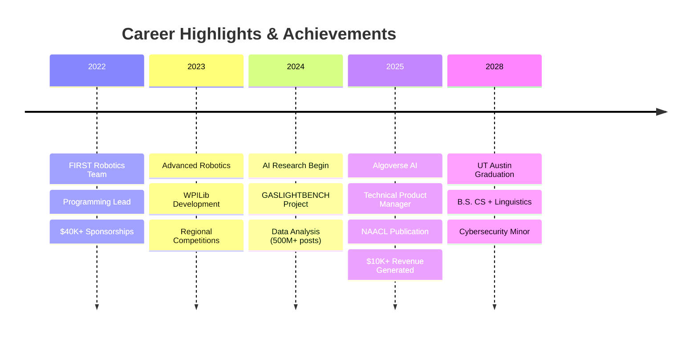

<div align="center">
  
  <!-- Animated Wave Header -->
  
  
  <!-- Dynamic Typing Introduction -->
  
  
  <!-- Professional Links with Hover Effects -->
  <br/>
  <a href="https://www.linkedin.com/in/swarit-srivastava-295133316/">
    
  </a>
  <a href="mailto:swaritsrivastava22@gmail.com">
    
  </a>
  <a href="https://github.com/swarit-1">
    
  </a>
  <a href="tel:+16263102979">
    
  </a>
</div>

<br/>

<!-- Animated Gradient Divider -->


##  About Me


```python
class SwaritSrivastava:
    def __init__(self):
        self.education = {
            "university": "UT Austin",
            "degree": "B.S. Computer Science + Linguistics",
            "minor": "Cybersecurity",
            "gpa": 4.0,
            "graduation": "May 2028"
        }
        self.current_focus = ["AI Safety", "LLM Robustness", "NLP"]
        self.research = "GASLIGHTBENCH - NAACL 2025"
        self.achievements = {
            "funding_raised": "$40,000+",
            "revenue_generated": "$10,000+",
            "volunteer_hours": "200+",
            "social_posts_analyzed": "500M+"
        }
    
    def get_expertise(self):
        return ["AI/ML", "Full-Stack Dev", "Security", "Product Management"]
```

##  Key Achievements

<div align="center">
  
| 🏆 Achievement | 📊 Impact |
|:---|:---|
| **NAACL 2025 Publication** | First-author paper accepted at <1% acceptance rate conference |
| **GASLIGHTBENCH** | Created 24K+ prompt benchmark for LLM safety evaluation |
| **Research Validation** | Human study correlation: κ = 0.72, r = 0.89 |
| **Sponsorship Success** | Secured $40K+ for FIRST Robotics, including Emirates partnership |
| **Data Analysis** | Analyzed 500M+ social posts, generated $10K+ revenue |
| **Community Impact** | 200+ volunteer hours across US, India, and Kenya |

</div>

<!-- Animated Skills Section -->
##  Technical Stack

<div align="center">
  
### Core Languages & Frameworks
<p>
  
  
  
  
  
</p>

### AI/ML & Data Science
<p>
  
  
  
  
  
</p>

### Web Development & Tools
<p>
  
  
  
  
  
</p>

### Cybersecurity
<p>
  
  
  
  
</p>

</div>

<!-- Featured Projects with Cards -->
##  Featured Projects

<div align="center">
  
| 🚀 Project | 💡 Innovation | 🛠️ Tech Stack | 🔗 Link |
|:---|:---|:---|:---:|
| **GASLIGHTBENCH** | 24K+ prompt benchmark measuring LLM robustness against social manipulation | `Python` `NLP` `Hugging Face` | [📄 Paper](https://github.com/swarit-1) |
| **Random Episode Generator** | Chrome MV3 extension with idempotent script injection & SPA resilience | `JavaScript` `Chrome API` `DOM` | [🔗 View](https://github.com/swarit-1) |
| **Google Forms Word Counter** | Real-time word count with regex tokenization & event-driven DOM manipulation | `JavaScript` `RegEx` `CSS` | [🔗 View](https://github.com/swarit-1) |
| **AlgoVerse Alert Bot** | Real-time automated surveillance system with algorithmic notifications | `Python` `Automation` `APIs` | [🔗 Code](https://github.com/swarit-1/algoverse-alert-bot) |
| **DAM Music** | High-fidelity audio streaming interface with library management | `TypeScript` `Audio API` `React` | [🔗 Code](https://github.com/swarit-1/dam-music) |

</div>

<!-- Research Impact Section -->
##  Research Impact

<div align="center">
  
  
  
  
</div>

<br/>

> **GASLIGHTBENCH: Quantifying LLM Susceptibility to Social Prompting**  
> *Introducing a comprehensive framework for measuring AI robustness against manipulation techniques including false authority, flattery, and assumptive framing. Benchmarked frontier models (GPT-4o, Claude, Gemini, Llama-3, Mistral) with validated human correlation.*

<!-- GitHub Stats with Animation -->
##  GitHub Analytics

<div align="center">
   
  
</div>

<div align="center">
  
</div>

<!-- Contribution Graph -->
<div align="center">
  
</div>

<!-- Professional Experience Timeline -->
##  Professional Journey



<!-- Languages & Soft Skills -->
##  Beyond Code

<div align="center">

### 🌍 Languages


### 💼 Leadership & Soft Skills


</div>

<!-- Quote Section -->
<div align="center">
  <br/>
  
</div>

<!-- Footer -->


<div align="center">
  
### 📫 Let's Connect!
*Open to collaborations on AI Safety, NLP research, and innovative engineering projects*

<p align="center">
  
  
</p>


</div>
