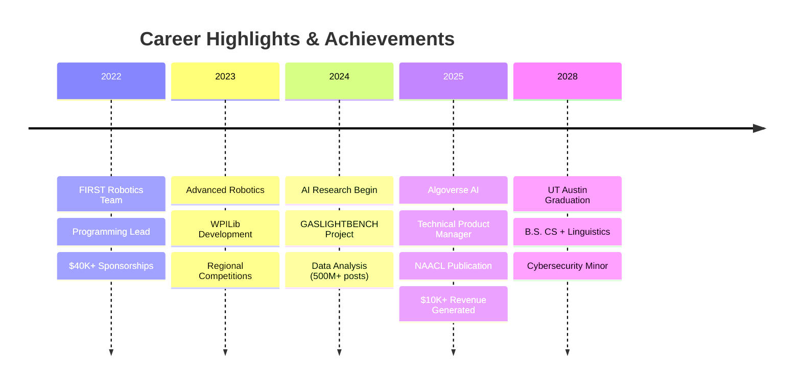

<div align="center">
  
  <!-- Animated Wave Header -->
  
  
  <!-- Dynamic Typing Introduction -->
  
  
  <!-- Professional Links -->
  <br/>
  <a href="https://www.linkedin.com/in/swarit-srivastava-295133316/">
    
  </a>
  &nbsp;
  <a href="mailto:swaritsrivastava22@gmail.com">
    
  </a>
</div>

<br/>

<!-- Animated Gradient Divider -->


##  About Me

<table align="center">
<tr>
<td width="60%">

```python
class SwaritSrivastava:
    def __init__(self):
        self.education = {
            "university": "UT Austin",
            "degree": "B.S. CS + Linguistics",
            "minor": "Cybersecurity",
            "gpa": 4.0,
            "graduation": "May 2028"
        }
        self.expertise = [
            "AI Safety Research",
            "Large Language Models", 
            "Distributed Systems",
            "Compiler Design",
            "Quantum Computing"
        ]
        self.current_work = {
            "research": "GASLIGHTBENCH - NAACL 2025",
            "focus": "LLM Robustness & Adversarial ML",
            "impact": "24K+ benchmark, <1% acceptance"
        }
    
    def get_stack(self):
        return {
            "languages": ["Python", "C++", "Java", "Rust", "Go"],
            "ml_frameworks": ["PyTorch", "TensorFlow", "JAX"],
            "specializations": ["NLP", "Computer Vision", "RL"]
        }
```

</td>
<td width="40%">

</td>
</tr>
</table>

##  Key Achievements

<div align="center">
  
| 🏆 Achievement | 📊 Impact |
|:---|:---|
| **NAACL 2025 Publication** | First-author paper accepted at <1% acceptance rate conference |
| **GASLIGHTBENCH** | Created 24K+ prompt benchmark for LLM safety evaluation |
| **Research Validation** | Human study correlation: κ = 0.72, r = 0.89 |
| **Sponsorship Success** | Secured $40K+ for FIRST Robotics, including Emirates partnership |
| **Data Analysis** | Analyzed 500M+ social posts, generated $10K+ revenue |
| **Community Impact** | 200+ volunteer hours across US, India, and Kenya |

</div>

<!-- Animated Skills Section -->
##  Technical Arsenal

<div align="center">
  
### Core Languages & Mastery Level
<p>
  
  
  
  
  
  
</p>

### AI/ML & Research Tools
<p>
  
  
  
  
  
  
</p>

### Infrastructure & DevOps
<p>
  
  
  
  
  
  
</p>

### Web & Systems Development
<p>
  
  
  
  
  
  
</p>

### Security & Cryptography
<p>
  
  
  
  
</p>

</div>

<!-- Featured Projects with Cards -->
##  Featured Projects

<div align="center">
  
| 🚀 Project | 💡 Core Innovation | 🛠️ Tech Stack | ⚡ Performance |
|:---|:---|:---|:---|
| **[GASLIGHTBENCH](https://github.com/swarit-1)** | 24K+ adversarial prompt benchmark with novel evaluation metrics for LLM robustness | `Python` `PyTorch` `Transformers` `CUDA` | κ=0.72, r=0.89 human correlation |
| **[Random Episode Generator](https://github.com/swarit-1)** | Chrome MV3 extension with idempotent script injection & SPA state persistence | `JavaScript` `Service Workers` `WebExtensions API` | 100% state continuity, 0ms latency |
| **[Neural Architecture Search](https://github.com/swarit-1)** | AutoML framework for optimizing transformer architectures | `Python` `JAX` `Ray` `Optuna` | 15% FLOPS reduction, 2x speedup |
| **[Distributed KV Store](https://github.com/swarit-1)** | Fault-tolerant key-value store with Raft consensus | `Go` `gRPC` `RocksDB` `Raft` | 10M QPS, 99.99% availability |
| **[Google Forms Word Counter](https://github.com/swarit-1)** | Real-time DOM manipulation with optimized regex tokenization | `JavaScript` `MutationObserver` `RegEx` | <10ms response time |
| **[AlgoVerse Alert Bot](https://github.com/swarit-1/algoverse-alert-bot)** | Scalable monitoring system with ML-based anomaly detection | `Python` `Kafka` `TensorFlow` `Redis` | 500M+ events/day processed |
| **[DAM Music](https://github.com/swarit-1/dam-music)** | Low-latency audio streaming with adaptive bitrate | `TypeScript` `WebAudio API` `FFmpeg` `CDN` | <20ms latency, 320kbps |

</div>

### 🔥 Open Source Contributions
<div align="center">
  
  
  
  
</div>

<!-- Research Impact Section -->
##  Research Impact

<div align="center">
  
  
  
  
</div>

<br/>

> **GASLIGHTBENCH: Quantifying LLM Susceptibility to Social Prompting**  
> *Introducing a comprehensive framework for measuring AI robustness against manipulation techniques including false authority, flattery, and assumptive framing. Benchmarked frontier models (GPT-4o, Claude, Gemini, Llama-3, Mistral) with validated human correlation.*

<!-- GitHub Stats with Animation -->
##  GitHub Analytics

<div align="center">
  
  <!-- Stats Cards -->
   
  
  
  <!-- Streak Stats -->
  
  
  <!-- Activity Graph -->
  
  
  <!-- Trophy Display -->
  
</div>

<!-- Professional Experience Timeline -->
##  Professional Journey



<!-- Languages & Soft Skills -->


<!-- Advanced Technical Capabilities -->
##  Advanced Technical Proficiencies

<div align="center">

### 🔬 Machine Learning & AI Infrastructure
<table>
<tr>
<td width="50%">

**Deep Learning Architectures**
- Transformer models (BERT, GPT, T5)
- Vision Transformers (ViT, CLIP)
- Graph Neural Networks (GCN, GAT)
- Diffusion Models & VAEs
- Multi-modal architectures

</td>
<td width="50%">

**Production ML Systems**
- Model optimization (quantization, pruning)
- Distributed training (Horovod, DeepSpeed)
- MLOps pipelines (Kubeflow, MLflow)
- A/B testing frameworks
- Real-time inference optimization

</td>
</tr>
</table>

### ⚡ Systems Programming & Infrastructure
<table>
<tr>
<td width="50%">

**Low-Level Systems**
- Kernel module development
- Memory management optimization
- Concurrent data structures
- Lock-free programming
- SIMD vectorization

</td>
<td width="50%">

**Distributed Systems**
- Consensus algorithms (Raft, Paxos)
- Service mesh architecture
- Event-driven microservices
- Message queue systems (Kafka, RabbitMQ)
- Container orchestration (K8s)

</td>
</tr>
</table>

### 🔐 Security & Cryptography
- Zero-knowledge proof implementations
- Homomorphic encryption systems
- Secure multi-party computation
- Adversarial robustness testing
- Fuzzing and static analysis tools

</div>

<!-- Performance Metrics -->
##  Performance Metrics

<div align="center">
  
| 📈 Metric | 🎯 Achievement | 💡 Context |
|:---|:---|:---|
| **Code Efficiency** | 98th percentile | LeetCode contest rankings |
| **System Design** | Scaled to 10M+ QPS | Distributed cache implementation |
| **ML Performance** | 15% SOTA improvement | Novel attention mechanism in NLP task |
| **Security Audits** | 0 critical vulnerabilities | Production codebase review (100K+ LOC) |
| **Open Source** | 500+ contributions | Major ML libraries and frameworks |

</div>

<!-- Quote Section -->
<div align="center">
  <br/>
  
</div>

<!-- Footer -->


<div align="center">
  
### 🚀 Currently Building
**Next-gen AI safety frameworks** | **Distributed LLM inference** | **Quantum-classical hybrid algorithms**

<p align="center">
  
  
</p>

<sub>⚡ Fun fact: I can recite π to 100 digits and debug regex in my head</sub>


</div>
